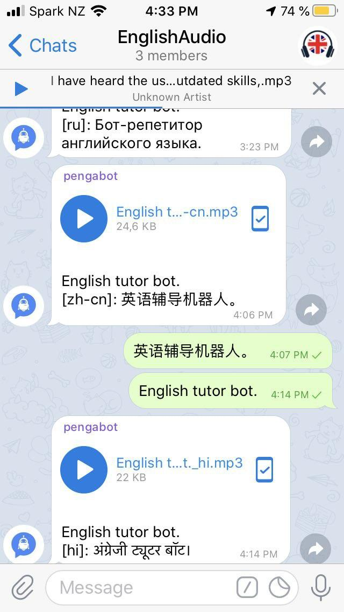
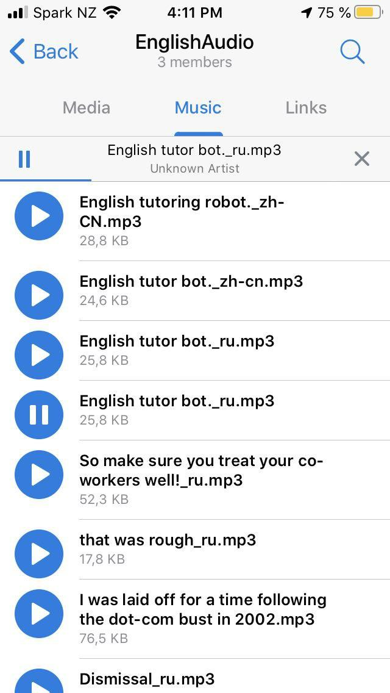
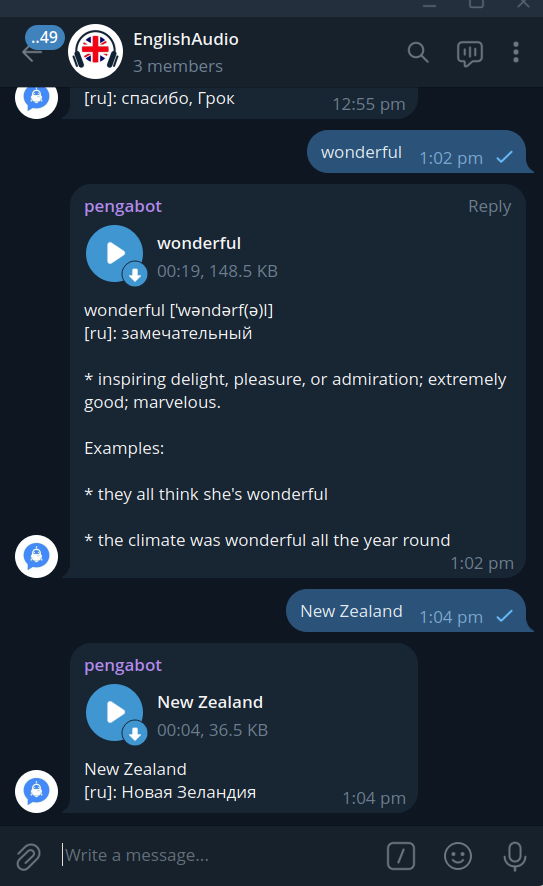

# Telegram Language Tutor Bot

A simple multilingual Telegram bot that helps you expand your vocabulary, learn new phrases, and improve pronunciation.

The bot supports any combination of native and learning languages.  
Just send a word or sentence to the Telegram chat where your bot is added — it will automatically translate it and send back an audio message with the pronunciation.

The audio message includes:

```
<the phrase in studying language>, 
<the phrase in your native language>, 
<the slow phrase in studying language>
```

### Audio Example

Audio example for English (studying language) and French (native language), generated by the bot:

<audio controls>
  <source src="examples/beautiful_city_fr.mp3" type="audio/mpeg">
  _Audio element is not supported here._
</audio>

[Download MP3](examples/beautiful_city_fr.mp3)

If you send a single word and the translation module provides definitions or examples, those will also be included in the audio file.

### Screenshots

<p align="center">
  
  
  
</p>

## 🚀 Getting Started

### Clone the repository

```sh
git clone https://github.com/vensder/language-tutor-bot.git
cd language-tutor-bot
```
### Set up a virtual environment

```sh
python3 -m venv venv
source ./venv/bin/activate
pip install -r requirements.txt
```

### Configure your environment

Copy the example `.env` file and replace the placeholder token with your real Telegram Bot API token:

```sh
mv .env.example .env
```

Or you can export it manually in your terminal:

```sh
export TELEGRAM_TOKEN=123456789:ABCDEFGHIJKLMNOabcdefghijklmnopqrst
```

If you don’t have a Telegram bot yet, create one using BotFather and get your token:

Create your bot with BotFather: https://core.telegram.org/bots/features#botfather

Authorize your bot: https://core.telegram.org/bots/api#authorizing-your-bot

### Configure your languages

Edit the configuration file and set your native language and learning language codes.
You can find all available language codes here:
👉 https://cloud.google.com/translate/docs/languages

### Run the bot

```sh
./main.py
```

### 🎧 Why It’s Useful

The bot saves audio files directly in your Telegram group or channel, so you can:

- Listen to them anytime on your phone (even while walking)
- Play them in sequence using the Telegram media player
- Delete the ones you’ve already memorized and add new ones easily

## 🐳 Run with Docker Compose

You can easily build and run the bot using Docker Compose.

### Set up your environment

Create a `.env` file in the project root (you can copy from `.env.example`) and update it with your real Telegram bot token and language codes:

```sh
cp .env.example .env
```

Example .env:

```sh
TELEGRAM_TOKEN=123456789:ABCDEFGHIJKLMNOabcdefghijklmnopqrst
LOGGING_LEVEL=INFO
LEARNING_LANGUAGE=en
NATIVE_LANGUAGE=fr
```

### Build the Docker image

```sh
docker compose build
```

### Start the bot

Run the bot in the background:

```sh
docker compose up -d
```

To check the logs:

```sh
docker compose logs -f
```

### Stop the bot

When you’re done, stop and remove the container:

```sh
docker compose down
```

This setup keeps your environment clean and allows you to run the bot anywhere with a single command.
